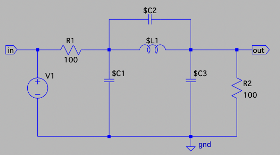
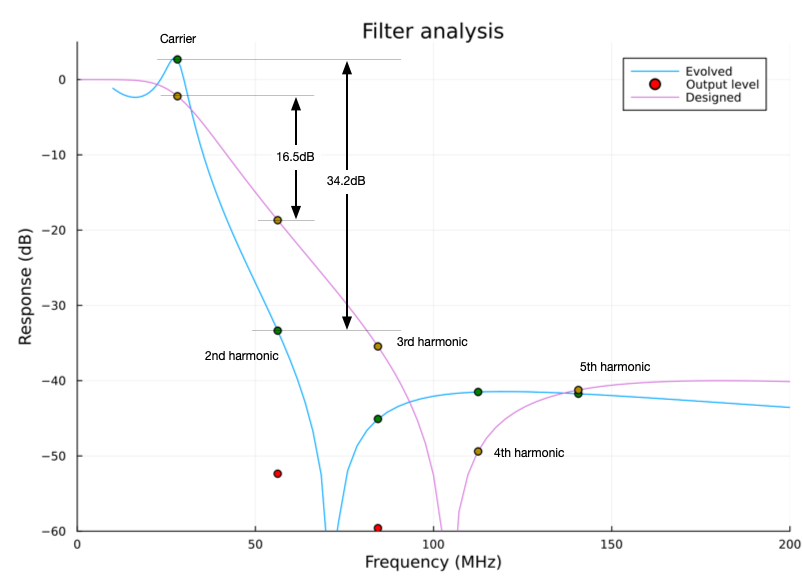

# Transmit filtering for direct frequency synthesis

Chips like the Si5351 all very simple systems to directly generate
frequencies up into the VHF band or even into UHF if the third
harmonic is used. Unfortunately, the generated signal is (roughly) a
square wave which means that before you connect it to an antenna, you
need to filter out undesired harmonics.

There are excellent design tools for that help you calculate a nice
filter, but what happens when you need to specialize to the particular
set of parts in your parts box? What happens when those components
vary with temperature or time? Is there a clever design hack that will
suppress harmonics more than a traditional filter might?

All of these questions and more can be answered with MicroSpice.

As a specific example, let's design a filter to eliminate harmonics
from a WSPR transmission in the 10m band (28.1261 MHz ± 100Hz). As a
wrinkle to this problem, we want to account for variations in
components and non-ideal input waveforms.

# What does success mean?

If you look at the spectrum of an idealized square wave, the second
harmonic is completely suppressed and the third and fifth harmonics
are roughly 9.5 and 14 dB below the fundamental. If the duty cycle of
the square wave is not exactly 50%, however, the second harmonic
becomes significant. In the context of a transmitter using a part like
the Si5351 to generate a variable frequency is that we need to use a
low pass filter to remove these harmonics. But that we want to
suppress different harmonics by different amounts because they will
be, to differing extents already suppressed. For instance, if we look
at the
[spectrum of a 55% duty cycle waveform](https://gist.github.com/tdunning/e551ae973422609f031c1bdca39ff5b4)
with 1ns rise and fall times, we see that the 3rd and 5th harmonics
are at roughly -10dBc and -15dBc as was the case with the ideal square
wave, but the 2nd and 4th harmonics are now non-negligible at just
above -20dBc (with the 4th a few dB _higher_ than all but the 3rd).

In addition, the frequency band for WSPR transmissions is very small
(just 200Hz). That means that we can design our system for a single
frequency instead of designing for a wide range of frequencies.  These
properties are interesting because it raises the possibility that we
can design a filter to take advantage of them.  The resulting filter
might produce better results than we might expect or be simpler for
the same performance.

Such a filter cannot, however, be designed using a standard recipe
such as Chebyshev or elliptic filter design. Such a standard filter
design will have very nice properties such as flat response in the
pass band and guaranteed suppression of the stop band, but such
properties really only matter when building a general system.  If our
goal is to transmit WSPR with harmonic output at least 40dB below the
fundamental accounting for filter response and the expected level of
harmonics from a nearly square wave output then our design goal should
match that requirement and say no more. Focusing on what is important
in the design will allow us to have much more effective designs.

For the rest of this example, we will compute the expected output
power of the first through fifth harmonics of our carrier and take the
smallest difference in power from the fundamental of the second
through fifth harmonics as our figure of merit. The output power is a
combination of the output from the signal source and the filter
response at these frequencies. Note that we absolutely don't care
about the frequency response below the fundamental or between the
harmonics so those aren't part of the figure of merit. For a single
set of circuit component values, we will simulate the circuit a number
of times to estimate the expected worst-case performance.

# Meta-evolution

The optimization algorithm we used for finding an optimum circuit is
known as "meta-evolution". What this means is that the algorithm is an
evolutionary one in that known solutions are perturbed to find new
solutions and the best ones are kept. The amount by which the old
solutions are perturbed depends on the mutation scale. It is useful
to have a high mutation scale early on so that we explore a lot of the
design space and have a lower mutation scale later on when we are
fine-tuning the solution. The meta part of the algorithm comes in the
adjustment of the mutation scale because the algorithm learns a good
mutation scale at the same time that it is learning about a good
solution.

The particular meta-evolutionary algorithm we are using here is called
"recorded step" evolution. In this system, each potential solution is
expressed as a vector and new candidate solutions are created by
adding scalar noise to each component of a vector as well as adding a
step in the same direction as the previous step that led us to the
current solution. The new value for the omni-directional mutation
scale is determined by sampling from the omni mutation itself. The new
directional mutation is obtained by taking the difference between the
previous and current position. This means that the factors that
control the mutation scale also control the new values of the same
factors, hence the name meta-mutation.

In practice, what meta-mutation does is that the system takes big
jumps when the solution is far from optimal and takes much smaller
steps as it approaches the optimal answer. You can see this happening
in this [graph](./images/meta-evolution.png). In the early
part, up to roughly generation 5, the algorithm is learning that it
needs to take bigger steps. After that point, it rapidly decreases the
mutation scale as it homes in on a good solution.

# Encoding the junk box

In order to make sure that we can build the circuit that we design, we
will do our optimization in a design space limited to component values
that I actually have in my parts collection. This collection includes
23 distinct values for C0G grade surface mount diodes and 39 distinct
values for surface mount inductors (or 67 values if we allow air core 
or toroidal ferrite core hand-wound inductors). The values are
arranged in increasing order and encoded as integers. Sorting the
values has the advantage that adjacent values are (usually) pretty
similar in value and increasing or decreasing the index of a component
value will have a consistent effect. Another benefit is that this
encoding effectively gives something like a log-scale of component
values since there are typically going to be a similar number of steps
from 10pF to 100pF as from 100nF to 1μF. For many physical problems
this sort of scale-invariant encoding can work very well.

The optimization of the filter we are designing only involves finding
component values for inductors and capacitors so we don't have to
encode resistors in the same way, but for other circuits this is
likely to be important.

# Results

The circuit being optimized is shown in the following schematic

This circuit is based on the circuit of an inverse Chebyshev filter.

The meta-evolutionary optimizer was run for 100 generations each with
a population of 100 potential solutions. At each generation 10% of the
population was retained and 90 new candidate solutions were generated
by directed mutation. Each candidate was scored by simulating the
response of the filter for 100 variations of the circuit with small
variations in the component values matching the specifications on the
components being used (5% precision for both inductors and
capacitors). Overall, each simulation requires about 900,000
simulation runs representing nearly 10,000 unique design and takes
just under 20 seconds on a MacBook Pro. Even with this large number of
simulations, the evolutionary algorithm only explores about 1% of the
possible designs and thus is much faster than an exhaustive search
would be even though both come to the same result.

A
[visualization of a typical optimization run](./images/evolution.gif)
was recorded by plotting the response for the best 10 circuits for
each generation into a multi-frame animated GIF image. In this
sequence, initial solutions are quite poor but rapidly improve. A
plateau is eventually reached, but once a solution is found with a
minimum response between the second and third harmonic an optimal
solution is found quickly.

To compare the result obtained using the evolutionary algorithms with
conventional approaches to filter design, I used the [LC filter design](https://markimicrowave.com/technical-resources/tools/lc-filter-design-tool/) web application
from Marki Microwave to design an inverse Chebyshev filter with a stop
band attenuation of 40dB and a cutoff frequency of 30MHz. Component
values were allowed to be exact rather than standard values. The
resulting design has very flat response in the passband and the
response does not exceed -40dB once it reaches that level at about
90MHz. The component values for each approach are shown in the
following table. 

| Component | Evolutionary | Designed |
| --------- | ---------   | ------- |
| L1 | 330nH | 768.2nH |
| C1 | 180pF | 27.86pF |
| C2 | 15pF | 3.03pF |
| C3 | 150pF | 83.9pF |

The response curves of each filter are shown in the following figure.

The striking result here is that the evolved circuit makes use of the
design freedom in the problem by using a large amount of ripple in the
pass-band combined with careful positioning of the response zero to
get very steep roll-off before the second harmonic. The impact of this
is that the evolved circuit is able to out-perform the standard design
by roughly 18dB at the second harmonic. This means that the second
harmonic is lower than -50dBc relative to the fundamental for the
evolved filter and the third harmonic is even lower.

This performance of the evolved filter is roughly on par with a 5th
order standard design that uses exact component values but it can be
built with parts on hand. On the other hand, it achieves this
performance at the cost of roughly 7dB of ripple in the passband which
would make the evolved design unusable in more general applications.

