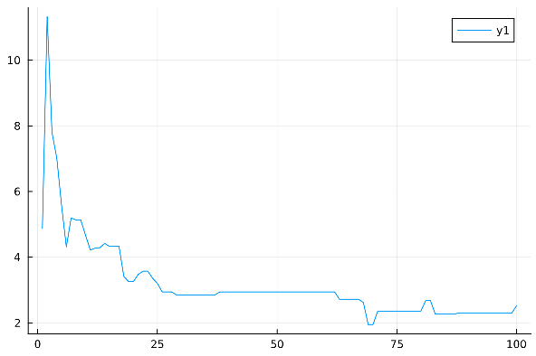
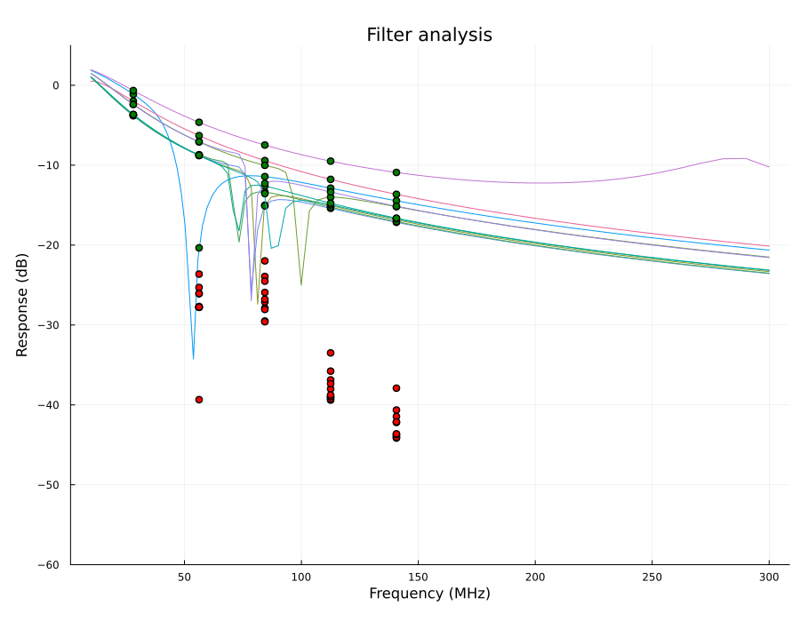

# Transmit filtering for direct frequency synthesis

Chips like the Si5351 all very simple systems to directly generate
frequencies up into the VHF band or even into UHF if the third
harmonic is used. Unfortunately, the generated signal is (roughly) a
square wave which means that before you connect it to an antenna, you
need to filter out undesired harmonics.

There are excellent design tools for that help you calculate a nice
filter, but what happens when you need to specialize to the particular
set of parts in your parts box? What happens when those components
vary with temperature or time? Is there a clever design hack that will
suppress harmonics more than a traditional filter might?

All of these questions and more can be answered with MicroSpice.

As a specific example, let's design a filter to eliminate harmonics
from a WSPR transmission in the 10m band (28.1261 MHz ± 100Hz). As a
wrinkle to this problem, we want to account for variations in
components and non-ideal input waveforms.

# What does success mean?

If you look at the spectrum of an idealized square wave, the second
harmonic is completely suppressed and the third and fifth harmonics
are roughly 9.5 and 14 dB below the fundamental. If the duty cycle of
the square wave is not exactly 50%, however, the second harmonic
becomes significant. In the context of a transmitter using a part like
the Si5351 to generate a variable frequency is that we need to use a
low pass filter to remove these harmonics. But that we want to
suppress different harmonics by different amounts because they will
be, to differing extents already suppressed. For instance, if we look
at the spectrum of a 55% duty cycle waveform
with 1ns rise and fall times, we see that the 3rd and 5th harmonics
are at roughly -10dBc and -15dBc as was the case with the ideal square
wave, but the 2nd and 4th harmonics are now non-negligible at just
above -20dBc (with the 4th a few dB _higher_ than all but the 3rd).

In addition, the frequency band for WSPR transmissions is very small
(just 200Hz). That means that we can design our system for a single
frequency instead of designing for a wide range of frequencies.  These
properties are interesting because it raises the possibility that we
can design a filter to take advantage of them.  The resulting filter
might produce better results than we might expect or be simpler for
the same performance.

Such a filter cannot, however, be designed using a standard recipe
such as Chebyshev or elliptic filter design. Such a standard filter
design will have very nice properties such as flat response in the
pass band and guaranteed suppression of the stop band, but such
properties really only matter when building a general system.  If our
goal is to transmit WSPR with harmonic output at least 40dB below the
fundamental accounting for filter response and the expected level of
harmonics from a nearly square wave output then our design goal should
match that requirement and say no more. Focusing on what is important
in the design will allow us to have much more effective designs.

For the rest of this example, we will compute the expected output
power of the first through fifth harmonics of our carrier and take the
smallest difference in power from the fundamental of the second
through fifth harmonics as our figure of merit. The output power is a
combination of the output from the signal source and the filter
response at these frequencies. Note that we absolutely don't care
about the frequency response below the fundamental or between the
harmonics so those aren't part of the figure of merit. For a single
set of circuit component values, we will simulate the circuit a number
of times to estimate the expected worst-case performance.

# Circuit Simulations as Callable Functions

The most important contributor to the software side of this project
is the ability that `MicroSpice` brings to have a circuit simulation
as a high-performance callable function. Having a callable simulation
is fundamentally different from having a human-usable simulator because
it allows us to call that simulator millions of times in the process
of optimizing a circuit for non-standard design requirements in the 
context of a limited parts menu and realistically variable component
values. This pattern of using a simulator as part of a much larger 
optimization system is a big trend in high-end problems like the 
design of fusion reactors, but it applies to small problems as well.

With `MicroSpice`, you can convert a Spice netlist into a function
that will compute the response of the circuit for given inputs and
parameter values. A single simulation takes a few microseconds and
multiple simulations can be run on different cores.

With this capability, we can use advanced optimizers such as meta-
evolution to derive an interesting circuit design.

# Meta-evolution

The optimization algorithm we used for finding an optimum circuit is
known as "meta-evolution". What this means is that the algorithm is an
evolutionary one in that known solutions are perturbed to find new
solutions and the best ones are kept. The amount by which the old
solutions are perturbed depends on the mutation scale. It is useful
to have a high mutation scale early on so that we explore a lot of the
design space and have a lower mutation scale later on when we are
fine-tuning the solution. The meta part of the algorithm comes in the
adjustment of the mutation scale because the algorithm learns a good
mutation scale at the same time that it is learning about a good
solution.

The particular meta-evolutionary algorithm we are using here is called
"recorded step" evolution. In this system, each potential solution is
expressed as a vector of values. New candidate solutions are created by
adding a randomized value to that vector. Recorded step evolution
maintains a history of recent mutations so that it can retain good
solutions as well as good momentum towards good solutions.
The way that this system evolves good solutions and good mutation rates
in the same process is why it is called meta-mutation.

In practice, what meta-mutation does is that the system takes big
jumps when the solution is far from optimal and takes much smaller
steps as it approaches the optimal answer. You can see this happening
in the graph below. In the early
part, up to roughly generation 5, the algorithm is learning that it
needs to take bigger steps. After that point, it rapidly decreases the
mutation scale as it homes in on a good solution.

# Encoding the junk box

In order to make sure that we can build the circuit that we design, we
will do our optimization in a design space limited to component values
that I actually have in my parts collection. This collection includes
23 distinct values for C0G grade surface mount diodes and 39 distinct
values for surface mount inductors (or 67 values if we allow air core 
or toroidal ferrite core hand-wound inductors). The values are
arranged in increasing order and encoded as integers. Sorting the
values has the advantage that adjacent values are (usually) pretty
similar in value and increasing or decreasing the index of a component
value will have a consistent effect. Another benefit is that this
encoding effectively gives something like a log-scale of component
values since there are typically going to be a similar number of steps
from 10pF to 100pF as from 100nF to 1μF. For many physical problems
this sort of scale-invariant encoding can work very well.

The optimization of the filter we are designing only involves finding
component values for inductors and capacitors so we don't have to
encode resistors in the same way, but for other circuits that would
likely be important.

# Optimization Results

The circuit being optimized is shown in the following schematic

This circuit is loosely based on an inverse Chebyshev filter. The various
component values for inductors and capacitors that we will be optimizing
are shown with values that start with `$` while component values that are 
fixed like the source and load impedance are shown as numbers. 

The meta-evolutionary optimizer was run for 100 generations each with
a population of 100 potential solutions. At each generation 10% of the
population was retained and 90 new candidate solutions were generated
by directed mutation. Each candidate was scored by simulating the
response of the filter for 100 small
variations in the component values (5% precision for both inductors and
capacitors). Overall, each optimization run requires about 900,000
simulations representing nearly 10,000 unique designs. The entire
process takes just under 20 seconds on a MacBook Pro. Even with this 
large number of simulations, the evolutionary algorithm only explores 
about 1% of the possible designs and thus is much faster than an 
exhaustive search would be. The nice thing about the evolutionary search
is that for this problem, the result is the same as produced by an
evolutionary search.

A visualization of a typical optimization run
was recorded by plotting the response for the best 10 circuits for
each generation into a multi-frame animated GIF image and is shown 
below. In this sequence, initial solutions are quite poor but 
rapidly improve. A plateau is eventually reached, but once a 
solution is found with a minimum response between the second and 
third harmonic an optimal solution is found quickly.

To compare the result obtained using the evolutionary algorithms with
conventional approaches to filter design, I used the 
[LC filter design](https://markimicrowave.com/technical-resources/tools/lc-filter-design-tool/) web application
from Marki Microwave to design an inverse Chebyshev filter with a stop
band attenuation of 40dB and a cutoff frequency of 30MHz. Component
values were allowed to be exact rather than standard values. The
resulting design has very flat response in the passband and the
response does not exceed -40dB once it reaches that level at about
90MHz. The component values for each approach are shown in the
following table. 

| Component | Evolutionary | Designed |
| --------- | ---------   | ------- |
| L1 | 270nH | 768.2nH |
| C1 | 180pF | 27.86pF |
| C2 | 15pF | 3.03pF |
| C3 | 150pF | 83.9pF |

The response curves of each filter are shown in the following figure.

The striking result here is that the evolved circuit makes use of the
design freedom in the problem by using a large amount of ripple in the
pass-band combined with careful positioning of the response zero to
get very steep roll-off before the second harmonic. Moreover, the 
response zero is positioned closer to the third harmonic than to the
second harmonic because the third harmonic requires more suppression.
The impact of this non-standard design is that the evolved circuit 
out-performs the standard design
by roughly 18dB at the second harmonic. This means that the second
harmonic is lower than -50dBc relative to the fundamental for the
evolved filter and the third harmonic is even lower.

This performance of the evolved filter is roughly on par with a 5th
order standard design that uses exact component values. The evolved 
circuit not only performs much better, but it can be
built with parts on hand. On the other hand, it achieves this
performance at the cost of roughly 7dB of ripple in the passband which
would make the evolved design unusable in more general applications.
Since we aren't building a general-purpose filter, this isn't a 
problem. The general-purpose design also uses components such as 
the 3pF that invite severe problems with parasitic effects because
of their extremely small values.

# Real World Test

To validate that these results make sense in the real world, I 
fabricated the filter design shown above on a surface mount breadboard 
and tested the filter response. Aside from the inductor, the circuit was 
relatively free of parasitic effects up to about 200MHz. The inductor had a
higher than intended value due to the relatively significant loop
area due to the way that the inductor is connected to the circuit.
These parasitics are characterized in detail 
[this note](https://gist.github.com/tdunning/cb968ac41c541ed09b56e7482cd00e7b)

The filter as built is shown on the left in this picture. And the 
frequency response of the filter is shown on the right.

As a size reference the inductor is wound on a T250-6 core so it is 
about 6-7 mm in diameter. The capacitors are surface mounted devices
on the back side of the board. The two most important practical aspects 
about building this circuit are to maintain a tight connection between
the connector grounds through multiple parallel paths and to measure 
and compensate for the parasitic inductance in the coil and connecting 
circuit and actual permeance of the core so that the value of the
inductor is what we expect. 

The response curve does not have as much ripple in the passband as the original 
design, but the difference between the response at the fundamental and the
second (~ -30dBc) and third harmonic (~ -45dBc) is certainly good enough
even though not quite as good as in the theoretical design. 
The final result when this filter incorporated in 
a WSPR beacon should roughly 50dB of suppression of these harmonics which is
an impressive result with just a single inductor filter. Based on simulations,
I suspect that the lower performance of the "as-built" circuit is due to 
non-ideal performance of the inductive core which results in moderate
Q of about 50-100 and due to a small amount of parasitic inductance
in the ground path between input and output. In a next round of design, 
this and other parasitic effects could be included in the evolutionary design.

Looking at a wider frequency range shows how some of the parasitics in the
circuit cause some misbehavior at much higher frequencies. These issues
were seen in a first prototype of this filter and even caused the 13th 
harmonic at roughly 365MHz to have insufficient suppression. This version 
of the filter has an additional RC filter with a cutoff at about 37MHz on 
the output so that very high harmonics have additional suppression. In 
this build of the filter, the response is -40dB or better out to 600MHz.

The real test of all of this comes when the filter is attached to a signal 
source. I used an Si5351 breakout board from AdaFruit initialized by a TinyGo
program running on a Raspberry Pico to generate a square wave at 28126.10KHz
which is in the 10m WSPR band. The spectrum was measured by a TinySA with 
40dB of input attenuation to protect the front-end. The spectrum produced by the 
Si5351 with and without the filter is shown below.

The original spectrum is shown in blue while the filtered output is shown in 
front in orange. The even harmonics are suppressed below the noise floor and 
the largest remaining odd harmonic is about 55dB below the carrier level which
is considerably better than the original -40dBc goal. The 
roughly 5dB of insertion loss is actually useful to avoid saturation of
downstream amplification stages.

# Summary

Having a circuit simulator that can be called directly from a high performance
optimizer allows application-specific circuit designs which substantially out-perform
more general-purpose circuits. This result isn't just theory; it plays out
that way with measurements on a real-world circuit. Further, the differences
aren't small. This circuit out-performs a conventional design by roughly 20dB
and is easier to build due to being customized to exactly the parts already
in stock. The required software is not complex, either. The setup of the 
optimizer is about a dozen lines of code including the circuit definition
and the parts inventory is about three dozen lines (your parts box is probably
bigger than mine).  The entire optimization takes about 20 seconds on a laptop 
to run the optimization. Since the entire system is open source you can add 
code to implement special capabilities that you need.

