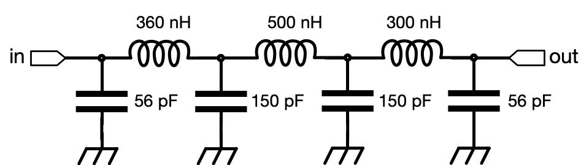
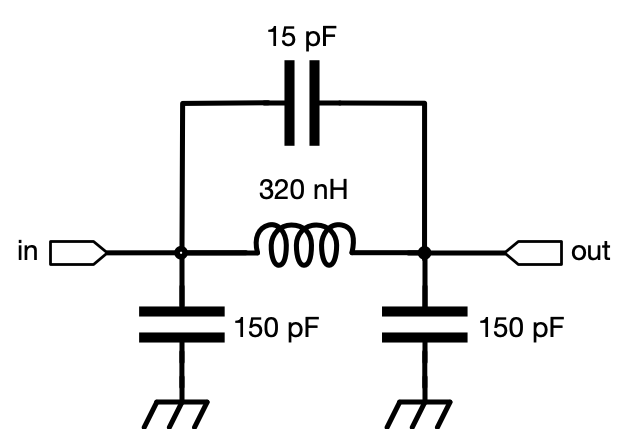
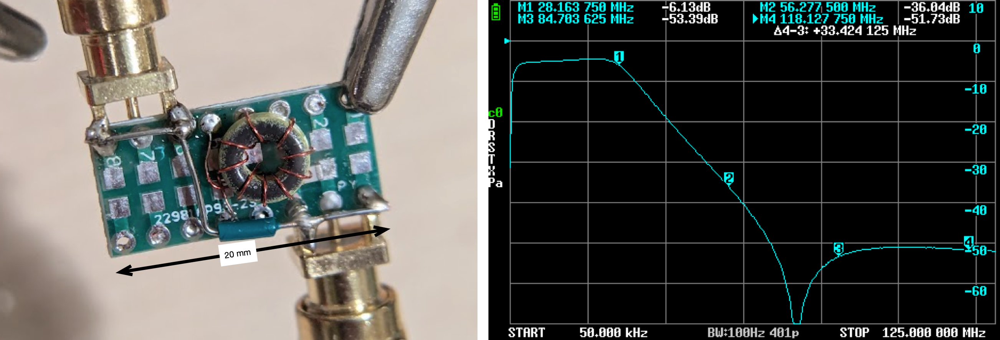
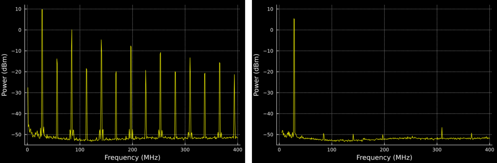
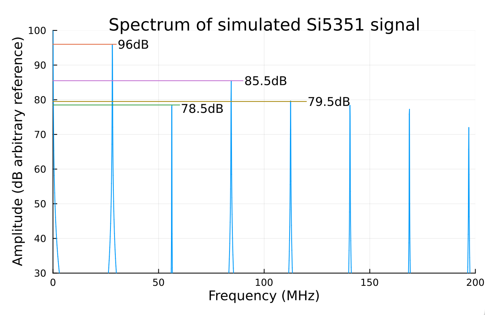
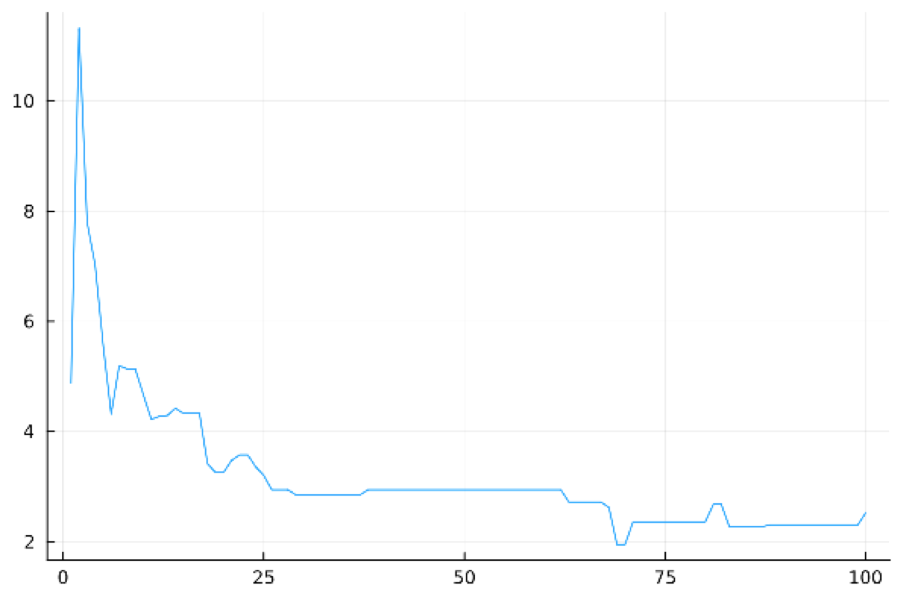

# Evolving New Circuits

Everybody who has ever designed and built an RF circuit has tweaked that design and coaxed a bit more performance out of it or compensated for non-ideal performance. That process of improvement through iterative designing and building is a big part of the joy in amateur radio.

But what if you could make millions of adjustments instead of just a few to get your circuit to meet exactly your own idiosyncratic needs? The resulting improvements could be very dramatic, in part because they are customized to your specific needs.

How then, can you actually do that? One way is to automate the process of tweaking. 

This article describes just how to do that and shows how the improvement in performance can be dramatic. This approach is similar to some of the much more ambitious efforts in AI circuit design \[[1](#references)\] that are beginning to show performance beyond what might be thought possible based on standard rules of thumb and expectations.

Fundamentally, this process works because of the combination of three major ideas. These are:

1. Application specific measurements of quality allow highly non-traditional design choices that can work much better than general-purpose designs.

2. We can turn circuits into tiny computer programs: Circuits become executable simulation functions with component values as inputs and our measurement of quality as output. 

3. We can evolve better designs by evaluating these circuit functions for many different component values. We can then use the quality measure to pick new values to try.

Before we dig into the method and theory, let's see an example of the results.

# A Better Filter

In a radio transmitter, it is typical to have an RF signal source (the exciter) that produces a low-level signal followed by one or more stages of power amplification. Some exciter designs, however, produce extraneous signals that would be amplified and result in undesired or even illegal transmissions unless removed. In modern designs, particularly with digital modes based on frequency-shift keying, it is common to use a frequency-agile clock generator such as the Si5351 as an exciter that produces substantial amounts of out-of-band signal.

To deal with this sort of issue, it is very common to use a low-pass or band-pass filter between the exciter and the power amplifiers. In the [T41 software-defined transceiver](https://github.com/peterbmarks/T41-EP-SDT) \[[2](#references)\], for instance, the filter for the 10m band is a 7th order LC network that can provide 30dB of suppression at the second harmonic at 54-59.4 MHz. This filter is shown in Figure 1 and is a fairly conventional Butterworth filter that has very nice properties beyond what is needed for this application.



***Figure 1***. _The 7th order Butterworth-inspired transmit filter for the 10m band from the T41 transmitter. See [https://github.com/peterbmarks/T41-EP-SDT](https://github.com/peterbmarks/T41-EP-SDT) for more information on the T41. Note that three custom-wound coils are required in this design._

In contrast, however, I recently designed and tested a filter for a WSPR beacon operating in the 10m band that exhibited the same 30dB of suppression at 50-60 MHz as the 7th order filter but only required a single inductor, as shown in Figure 2 This simpler filter design takes inspiration from a 3rd order inverse Chebyshev design, but the inverse Chebyshev design has less than 18dB of suppression at the second harmonic.



***Figure 2.*** _A simpler filter design that exceeds the performance of a conventional design in the context of the specialized requirements for a 10m WSPR beacon._

So, what is going on? 

We know that [Stephen Butterworth](https://en.wikipedia.org/wiki/Stephen_Butterworth) was no fool, and his filter design methodology produces optimal filters given his very general design assumptions and goals. How is it that the dramatically simpler circuit in Figure 2 is possible without catastrophic (or even any) loss of performance? Did he miss something obvious?

The answer lies in the fact that in Butterworth's 1930s world of slide rules and nomograms, it was necessary to come up with closed form solutions for a few general-purpose designs that would fit a broad range of applications and require limited computation. Modern computers turn the assumptions of this design style upside down at almost every step. We no longer need to use only general purpose designs, but we can instead take very specific design constraints into consideration. We don't have to reduce everything to simple formulas. Now we can throw a large amount of computation at the problem. The designs that result can be massively better. 

For this particular design, the constraints, assumptions and goals were:

1) This filter is to be used in a single-band WSPR beacon, so we only need to consider a very narrow band of transmitted frequencies. This limited scope of use makes conventional design goals like phase linearity and passband flatness irrelevant.

2) The key figure of merit is the power (after filtering) of the strongest harmonic relative to the carrier. Suppression of non-harmonic frequencies is irrelevant since they aren't present.

3) This tuned circuit is used between gain stages and does not need to present a well behaved output impedance to an antenna.

4) The harmonics produced by the Si5351 are already somewhat suppressed with even harmonics more suppressed than neighboring odd harmonics. This means that we can trade-off suppression of some harmonics to get better suppression of others.

5) Component values should be those already found in my parts bin.

6) Performance should be robust with respect to expected component variation.

7) Insertion loss of up to 10dB is acceptable.

These constraints and goals are very different from the ones used in general-purpose filter designs. As an old saying saying goes, you choose the answer you get by the question you ask.

A breadboard version of the resulting filter together with the measured performance are shown in Figure 3\. The locations of the first through fourth harmonics are marked.



***Figure 3.*** _A breadboard implementation of the simplified filter and the measured response of the filter. The response has the first through fourth harmonics marked and shows \-30dB response for the second harmonic relative to the first and \-50dB for the third. Note how the response below the first harmonic is not flat and the insertion gain is significant._

When applied to output from the actual signal source, the results are dramatic as shown in Figure 4\. Only the odd harmonics can even peek above the noise floor and the strongest remaining harmonic is the 11th at 300MHz. In any case, all harmonics are at least 50dB below the carrier.



 ***Figure 4.*** _Dramatic suppression of unwanted signals: The measured output spectrum from the Si5351 signal source is shown on the left and the filtered output on the right. The even harmonics are not completely suppressed in the input because the waveform is not exactly symmetrical. Note the near strong suppression of all harmonics._

The filter works by putting the filter zero between the second and third harmonic to get balanced suppression of these two harmonics. That would be unacceptable for general use because this positioning causes ripple and phase irregularities in the passband but it works very well in this design because we get very strong suppression of the second and third harmonics. By the time we get to the fourth and fifth harmonics at 112 and 140 MHz, the normal attenuation of a third order filter is sufficient, particularly since these harmonics are weaker in any case.

So how did the software come up with these component values? That's the topic of the next section.

# Evolution in Action

The circuit described in the previous section was designed by taking the basic form of the circuit as fixed and using an evolutionary algorithm to find good component values. There are three parts of this process, defining the figure of merit to optimize, encoding the circuit as a callable function and the optimization process itself. Each part builds on the previous ones.

## Figure of Merit

The figure of merit for a circuit should mirror its actual use. For the filter in this article, the primary goal is that the combination of exciter and filter produces minimal unwanted signal energy while allowing as much of the desired signal through. Further, when we say minimal, we really mean that the biggest unwanted signal in the final output should be as small as possible and we also want to consider the reasonable range of values each component might have given the precision of each value. 

To compute the signal levels at the output, we need to know the levels at the input and the response of the filter. The [datasheet for the Si5351](https://cdn-shop.adafruit.com/datasheets/Si5351.pdf) indicates that the worst-case asymmetry of the output on the device is 55% duty cycle and that the rise time on the signal at full drive is about 1ns. We can use these numbers to simulate ([simulation code here](https://gist.github.com/tdunning/e551ae973422609f031c1bdca39ff5b4)) what the output spectrum should look like to get something like Figure 5\.



***Figure 5.*** _The simulated spectrum of a signal with 55% duty cycle and 1ns rise/fall times shows how large the even harmonics can be. The level of the odd harmonics is not changed very much with duty cycles in the 45-55% range even though duty cycle affects the even harmonics strongly._

This simulated spectrum lets us know that the second harmonic is already attenuated nearly 20dB while the third harmonic is only just a bit more than 10dB down. We can take the amplitude of each harmonic relative to the fundamental and add the filter response at that frequency to get an estimated output after the filter to get the core of our figure of merit. The corrections that I used are shown in the following table:

| *Harmonic* | *Frequency (MHz)* | *Input Level (dBc)* |
| ----: | ----: | ----: |
| Fundamental | 28.13   | 0 |
| 2 | 56.25 | \-19.0 |
| 3 | 84.38 | \-14.5 |
| 4 | 112.50 | \-24.0 |
| 5 | 140.63 | \-27.0 |

***Table 1.*** _Simulated levels for filter input. These values will be added to the filter response to get the estimated output levels. These values are computed with a 55% duty cycle. For a duty cycle closer to 50%, the even harmonics will decrease while odd harmonics will stay nearly constant. Thus, a filter that works for these levels will work at least as well for more symmetric inputs._

It is useful to add the response at the fundamental frequency with a weaker weight as secondary correction to this figure of merit to avoid the optimization algorithm from finding very strange filters that appear to have good harmonic attenuation at the cost of insertion losses in the range of 50-100 dB. Not only would it be expensive in practice to recover that much gain, but such filters probably depend on round-off effects to appear useful.

Finally, to be sure that a solution is robust to component variations, we can sample the merit of 100 different solutions with random variations in component values and take the worst-case as the final figure of merit for a particular design.

## Circuits as Functions

In order to compute the figure of merit, we need to be able to compute the filter response for specific frequencies and component values. There are a number of fully featured open source circuit simulators available such as [LTSpice](https://www.analog.com/en/resources/design-tools-and-calculators/ltspice-simulator.html), [NGSpice](https://ngspice.sourceforge.io/) or [Xyce](https://xyce.sandia.gov/) but these systems are large complex beasts optimized for the interactive simulation of large circuits. They can be made to work for the problem at hand, but integrations with such large systems tends to be very cumbersome. In particular, the turn-around on the simulation of a small circuit is likely to be dominated by startup overheads. To see why this can become a problem, consider an evolutionary process that runs for 100 generations, considers 100 configurations for each generation and runs 100 simulations on variants of each configuration. If the setup for a simulation is 10ms, then this will turn into hours of overhead.

To avoid this problem, I wrote an open source [circuit simulator in Julia called MicroSpice](https://github.com/tdunning/MicroSpice.jl) that supports AC small signal simulations of circuits with only passive components. Even on just a laptop, MicroSpice can run tens to hundreds of thousands of simulations per second which is ideal for evolving circuit designs. To use the simulator, you write a Spice-compatible netlist for the circuit (typically done using a schematic entry tool such as LT Spice) and use that to create a simulator as shown in Listing 1\.

```julia
nl6 = MicroSpice.Netlist(raw"""
R1 in N001    85
L1 N001 out  $L1
C1 N001 gnd  $C1
C2 N001 out  $C2
C3 out gnd   $C3
R2 out gnd   50
""", [:L1, :C1, :C2, :C3], [:in, :gnd], [:out])
```
***Listing 1.*** _A simulator can be created in MicroSpice by specifying the Spice netlist of the circuit and identifying the parameters, inputs and outputs of the circuit._

This simulator is a function that accepts a frequency, input voltages and a list of parameter values. The result is a list of the outputs of the circuit. We need to do just a bit more, however, since we want the maximum response for several frequencies as adjusted by input levels. We also want to vary that over many components. This additional complexity is handled by the code in Listing 2\. The quality function handles the variation of component values with a fixed 5% tolerance for all components while the q0 function handles the computation of the largest output harmonic. 

Julia is very useful for this kind of computation, partly because it allows easily multi-threading, vectorized computations using functional programming (`i -> begin ... end` introduces an inline function), list comprehensions and vectorization of primitive operations (`x .+ y` is a vector sum and `f.(v)` is a vectorized application of the function `f` to vector `v`). All of these expressions are compiled down to native code which is important in performance sensitive computations like this. The effect is that we get the expressivity of a language like Python, but with performance as good or better than C++. In many cases, these vectorized expressions can be compiled down to code that never even has to allocate vectors to hold intermediate values giving even higher performance.

So now we have a function to compute the figure of merit for the actual filter we are building. The next step is to find the best component values to optimize the performance of the filter.

```julia
"""
Finds a worst case value of performance over variation of component values
"""
function quality(sim, parameters, frequencies, penalties)
    let n = 100
        maximum(i -> begin
                    p = parameters .* (1 .+ 0.05 *randn(size(parameters)))
                    q0(sim, p, frequencies, penalties)
                end, 1:n)
    end
end

"""
Internal function that returns the fitness of a solution prioritizing
the net attenuation at frequencies of interest adjusted by penalties.
There is a secondary goal the encourages low attenuation at the primary
frequency.
"""
function q0(sim, parameters, frequencies, penalties)
    response = [20 * log10(abs(only(sim(f, [2,0], parameters)))) for f in frequencies]
    net =  (response[2:end] .- response[1]) .+ penalties
    return maximum(net) - response[1]/2
end
```
 ***Listing 2.*** _The basic simulator is wrapped in code to vary component values (in `quality`) and compute the strongest harmonic (in `q0`)_ 

## Evolutionary Optimization

Given a simulation function that computes the quality of a design given component parameter values, we are left with the problem of finding the best values. To kick this off, I inventoried my parts bin to get all of the values of surface mount resistors, capacitors and inductors I have. In addition, I built a small function that can compute the inductance of coils built on the cores that I have and calibrated that function against observed values. 

As a first optimization strategy, I wrote a program that simply iterated over all possible combinations of components. My parts box isn't as big as some peoples, but this still took a ***long*** time to run. I wanted something that gets a design in less than a minute so that I can try alternative circuit configurations quickly.

To reduce the time to optimize a circuit, I switched to an evolutionary algorithm. The basic idea here is simple: you randomly select a wide range of random circuits and evaluate them. Keep the best few and iterate by generating a new population of potential solutions by mutating each of the surviving circuits by a small amount to get new candidates. In each generation, the candidate circuits are based on the best known circuits from the previous generation so you eventually find the best solution. 

The problem with this simplest form of evolutionary algorithm is that if you create new candidates by very small mutations, it can take a very long time to find the best answer if you start with candidates that are far from the best. On the other hand, if you use large mutations, you may find the neighborhood of the best circuit quickly, but it will be hard to make the small changes needed to find the very best answer. What is needed is a way to start with big mutations and then, over time, reduce the scale of mutation to allow fine-tuning.

The algorithm I used does this adjustment of scale by including the scale (and direction) of previous mutations as part of each candidate solution. This allows our program to adjust the mutation scale at the same time as it is adjusting the solution. The effect of this "meta-mutation" is that the scale of mutation starts out big because big changes help when we don't have very good solutions, but the scale decreases as the solutions converge to the best possible value. Figure 6 shows an example of how this self-adjustment in action.



***Figure 6.***
_The scale of mutation (vertical axis) jumps up at the beginning of an optimization and then drops down as fine-tuning becomes important. The generation number is on the horizontal axis._

We can see the process of evolution of optimal circuits in the panels of Figure 7 (an [animated version is available online](https://github.com/tdunning/MicroSpice.jl/blob/main/examples/xmit-filter/images/evolution.gif)). By generation 14, the system has learned that moving the zero response near the 3rd harmonic is a good idea both because the 3rd harmonic is attenuated, but also because the resulting ripple decreases insertion loss. The level of ripple in these circuits would be unacceptable for general use, but is fine for this application as long as component variation is not a problem.

Shortly after, by generation 29, the system has learned to straddle the 2nd and 3rd harmonics with the response zero, but hasn't learned quite how to balance the responses. In this diagram, the green trace has the zero near the 2nd harmonic and is thus good at suppressing the 2nd harmonic, but poor on the 3rd. The light blue trace, on the other hand, has the opposite problem because the zero is closer to the 3rd harmonic.

Considerably later, by generation 100, all of the top solutions are very close to the same answer and all of the nearby alternatives have been tested and rejected. The performance is relatively well balanced with the worst case harmonic output predicted to be at least 50dB below the fundamental. As built, the filter produces a slightly different response, probably due to parasitic effects or because the input has a better symmetry than we have modeled here. The ripple in the pass band does not appear (probably due to parasitic resistance) and the output level of the 3rd harmonic is bigger than the second. Referring back to Figure 4, we can see that the 2nd harmonic is about 6-7dB lower than we accounted for. This indicates that the duty cycle is probably about 52% instead of the worst case 55% used in the optimization.

One fun hack in this evolutionary optimization is that all of the component values were encoded by an index into an array of all in-stock components sorted by value. This representation has the benefit of proximity in that similar indexes will usually have similar component values and provides a very rough logarithmic transformation of parameter values simply due to the way that component values happen naturally. The resulting designs are inherently buildable because they can only express available parts, but the representation maintains topological simularity to the underlying physics which helps the evolutionary optimization converge.


***Figure 7.*** _The evolutionary algorithm at different stages of convergence. In each panel, each curve is a different design and the green dots on the curves are the filter response at a harmonic frequency. The red dots represent output amplitude after accounting for input level. Initially, all solutions produce poor results. By generation 14, the system has learned to drive the 3rd harmonic very low, but this leaves the 2nd at too high a level. By generation 29, the system has a number of alternatives that focus either on the 2nd or 3rd harmonic, but none with really good balance. By generation 100, all solutions attenuate all harmonics very well. The residual imbalance is probably due to the system hedging against component variations. From generation 14, all filters attenuate the 4th and higher harmonics sufficiently that they are no longer in the frame of view._

# Conclusion

The method described here can produce surprisingly good designs that perform much better than would be expected from normal rules of thumb. The method is also much simpler and does not require sophisticated computers to run, in contrast to other AI-based algorithms.

The components of this method can also be applied separately if desired. For instance, the way that the simulator provides a view of circuit designs as lightweight functions has applicability to a broad range of problems and techniques. Similarly, the idea that design goals and constraints can be much more specifically targeted to a particular application is useful whenever optimization techniques are available. Finally, the meta-evolutionary algorithm and design encoding method used here are widely applicable to many kinds of simulation based design efforts. Taken together or separately, all of these components are freely available for use or extension to whatever problems you want to solve and contributions back to the software are welcome.

# References {#references}

\[1\] Karahan, E.A., Liu, Z., Gupta, A. *et al.* [Deep-learning enabled generalized inverse design](https://rdcu.be/d5TPy) of multi-port radio-frequency and sub-terahertz passives and integrated circuits. *Nat Communications* 15, 10734 (2024). [https://doi.org/10.1038/s41467-024-54178-1](https://doi.org/10.1038/s41467-024-54178-1)

\[2\] Source and design files for the open source Software Defined Transceiver. GitHub repository. [https://github.com/peterbmarks/T41-EP-SDT](https://github.com/peterbmarks/T41-EP-SDT)

